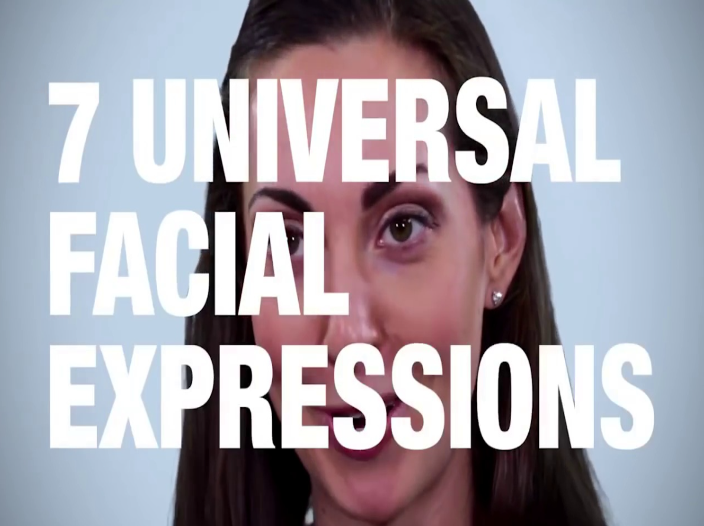
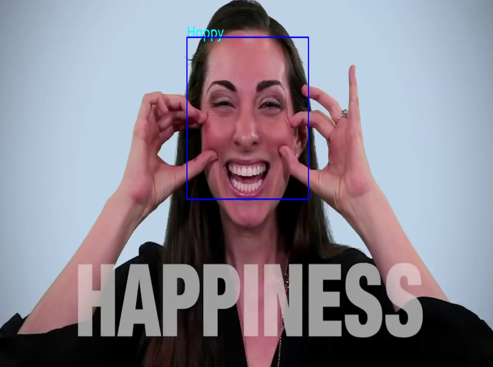
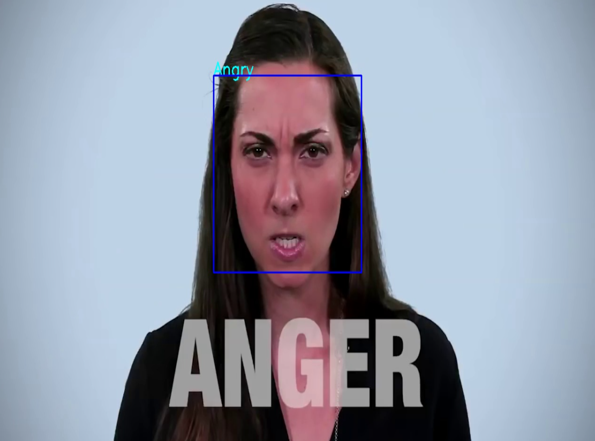
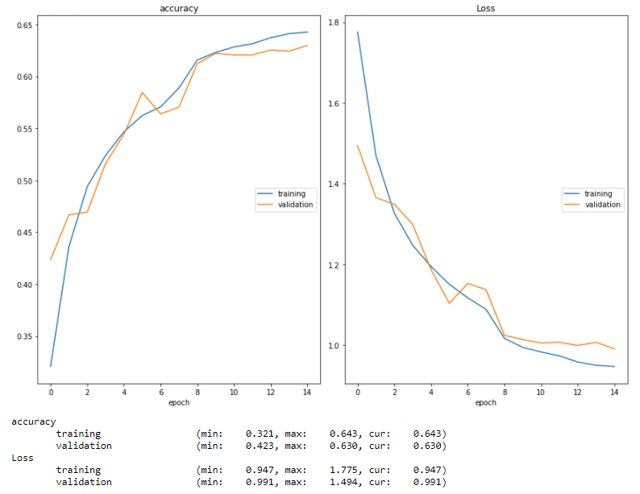
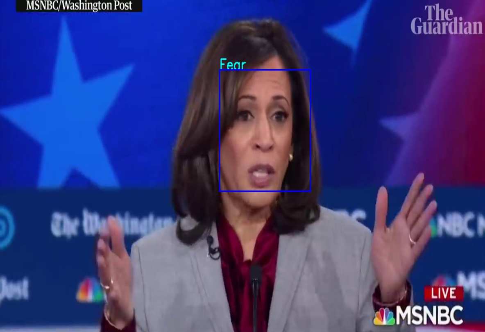
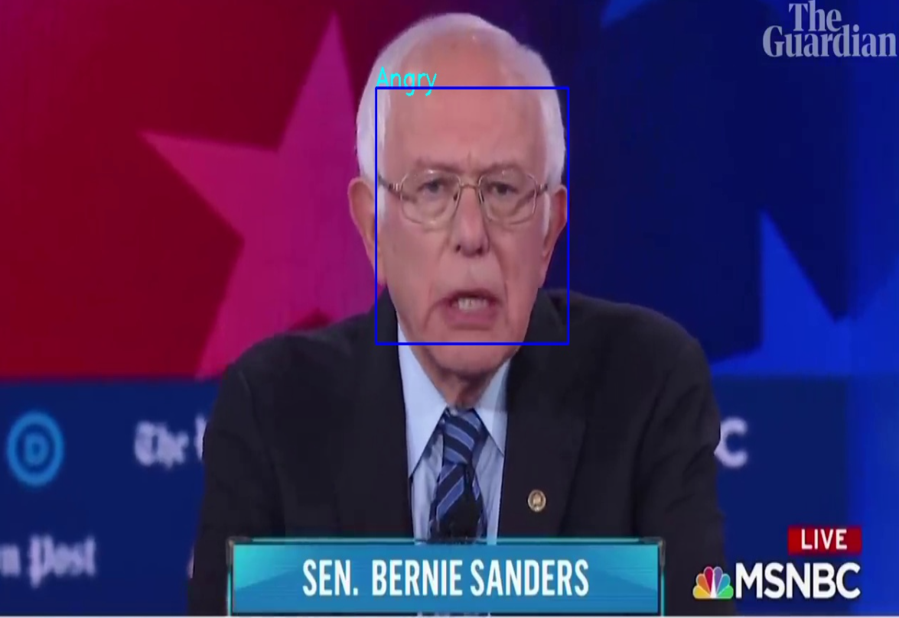
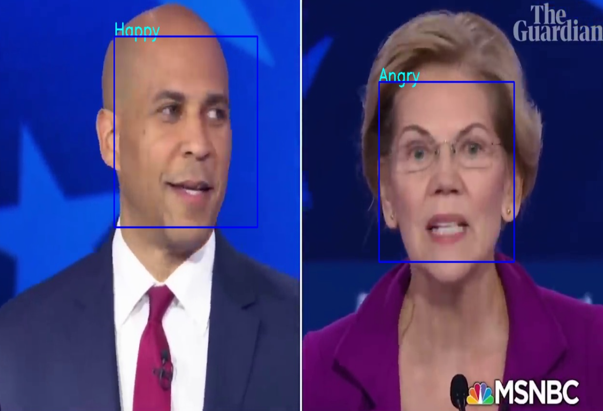

# Facial-Expression-Recognition
AI / ML project - build and train a convolutional neural network (CNN) in Keras to recognize facial expressions. Using the infamous Tensorflow-Keras library, I attempt to create a machine learning model that outputs the expression depicted on an image or video. 

Credit: [Coursera Course](https://www.coursera.org/learn/facial-expression-recognition-keras/home/welcome)
 
Jupyter Notebook with ML Program: [View Notebook](https://nbviewer.jupyter.org/github/gianmillare/Facial-Expression-Recognition/blob/main/Project/Facial_Expression_Recognition.ipynb)

### Process
The project started with training a model using resources supplied by the course. Preprocessing included splitting the resources (approximately 30,000+ images) into a training and testing data set. Those images were then fed into a convolutional neural network along with the expressions that the images were depicting.

The result was a fully trained model that shifted through thousands of images to 'predict' the expression created on freeze-framed images of a video. 

### Flask App
The project was deployed using other python files. Camera.py is used to create square around the facial expressions on the video, as well as launching the video on the local website. Model.py was used to pass in the images captured by camera.py into the facial expression model created in the jupyter notebook. 

The model obtained an accuracy of between 62-65%. May not be ideal but the model was trained using CNNs with only 15 iterations. If time permits, more epochs would be appreciated, and (may) result in a higher accuracy rating.

### Final: The model was then launched and tested using a new video. The presidential debate. 

