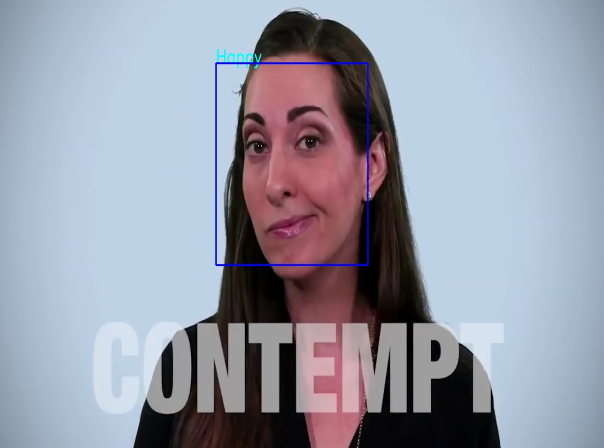
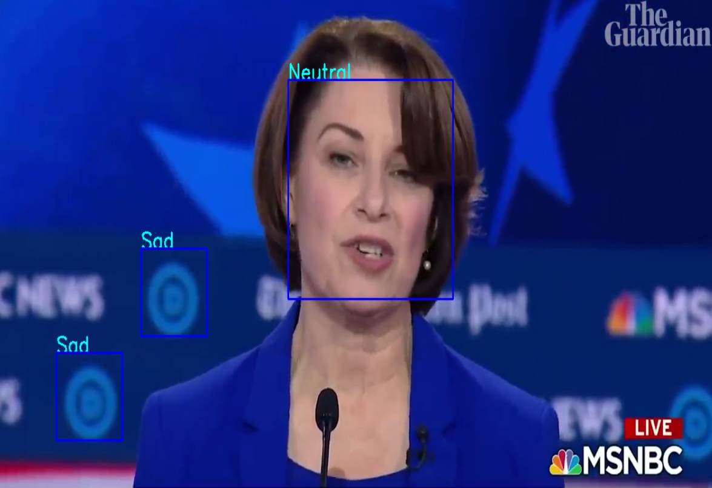

# Facial-Expression-Recognition
AI / ML project - build and train a convolutional neural network (CNN) in Keras to recognize facial expressions. Using the infamous Tensorflow-Keras library, I attempt to create a machine learning model that outputs the expression depicted on an image or video. 

Credit: [Coursera Course](https://www.coursera.org/learn/facial-expression-recognition-keras/home/welcome)

### Goal: The model should predict facial expressions made throughout the video. (i.e. Happy, Angry, Surprised, Neutral, etc.)

### The model was tested on the US Presidential Debate.

